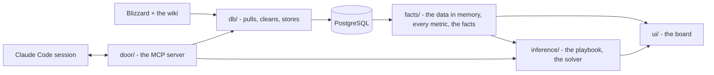

# Countrix

[](https://github.com/mmikol/countrix/actions/workflows/ci.yml)


The Overwatch 2 team composition that counters the one in front of you.
Countrix keeps hero kits, maps, counters and per-map win rates in PostgreSQL,
turns a draft into numbered facts, and finds the highest-scoring six under a
playbook of markdown strategy files a person can read and tune. Every reason it
gives cites a fact.


*King's Row, blue on attack, two picks a side, Widowmaker banned. The solver
fills blue's six around Ana and Reinhardt, and red's dashed tiles are its
likely six; blue's badge is its six as a share of the best six it could field
here. The pictures run the shipped playbook with the default engine off, so no
number in them reads Blizzard's win rates, which Blizzard licenses for personal
use only: where the fight odds would be, the strip shows the engine's verdict,
red's badge - how often its heroes are picked - is hidden, and the cards leave
out their rate phrases.*

## What it does

- **Pulls the game.** Blizzard's hero pages and win rates, the Overwatch wiki's
  kits, maps, counters and synergies - cached, rate-limited, no API keys.
- **Turns a draft into facts.** Map, side, bans and both teams' picks become
  numbered facts (F1, F2, ...): a hero on this map, against each enemy, beside
  each ally, the six against the six.
- **Solves the comp.** Maxims (the playbook) and facts (the data) make
  one weighted, constrained objective, solved exactly
  ([how a six is chosen](docs/inference.md#how-a-six-is-chosen)). The
  space is every six of the released roster, each set of heroes once, at
  most two tanks, and the playbook's constraints prune it, weighing
  nothing: 13,030,920 legal sixes on an open board on the roster of
  2026-10-05, fewer with bans or locks. A default engine, the meta, scores every six left on its win
  rates on the map trusted by pick rate, the wiki's synergies and its
  counters to the other side - the wiki's, and answers derived from the
  kits where the wiki says nothing - and one meta weight scales it. The
  heuristics add or subtract from the same facts, each times its weight.
  A branch-and-bound search proves the best six, scoring a few dozen in
  full, and returns the next best in order; every reason cites a fact.
  No weight is learned: a rule's starts from its prose, the engine's
  from a calibration, and each one is yours to turn.
- **Scores the swaps.** A six is not held for the map. Above blue's picks
  the board suggests the swaps that pay for their cost, as one joint
  answer: the incoming hero's portrait over the pick it replaces, a click
  to take it. On a map with stages it lays the map out a stage at a time,
  each phase keeping its heroes unless a swap there beats the cost, with a
  plan for each stage worded from the facts.
- **Serves it two ways.** A web board and an MCP (Model Context Protocol)
  server, the tool interface a Claude Code session uses to draft comps and
  tune the playbook. The solver is arithmetic; the board
  never calls a model.


*Why these six: each pick's reasons, each cited to a numbered fact.*


*How they scored: one bar per strategy, each with the fact it read. A limit
that holds adds nothing; what a six gives up shows under costing. The count over
the bars is the space the exact search covered.*

## How it works



Three layers over one database, each a package, and a test fails any import that
reaches up a layer. Every write goes through one door, the MCP server. Every
metric is defined once, so the number on the board and the number the solver
maximises come from the same function.
The playbook is markdown: each strategy is a file with a few lines of
frontmatter, `meta.md` beside them holds the default engine's weights, and
the solver reads nothing else.

## Engineering

- **The tests.** CI runs ruff, mypy and every test that needs no database
  on every push to main and every pull request, held to 78% line coverage.
  With the database built, all of them run against a 75% floor.
  They sit in three folders: QA (the house rules), verification (the code
  against its spec) and validation (against recorded games, empty for now).
- **The search is held to brute force.** A CI gate enumerates every legal six
  on small synthetic boards and fails unless the search returns the true best
  sixes in order, and a fuzz holds every bound to the sixes it covers; on the
  built database a brute force of every legal six on real boards agrees with
  it bit for bit. The board's study page writes out the proof, lemma by
  lemma, beside the study's results.
- **Deterministic.** A board is the same payload under any hash seed: one
  total order, each six scored in one seat order.
- **Typed throughout.** mypy checks every source module in CI; records that
  cross a module boundary are dataclasses, NamedTuples or TypedDicts.
- **One door for writes.** 27 MCP tools over stdio, HTTP or in-process, each
  schema-checked; the query tool runs as a read-only database login.
- **Five hardened containers.** Three services share one image and, with
  the nightly `pg_dump`, run unprivileged on a read-only root with every
  capability dropped; PostgreSQL keeps the five capabilities it needs to
  start. Every port binds to loopback, and every HTTP server refuses a
  foreign Host or Origin.
- **Tested documentation.** Relative links resolve, every setting is documented,
  and the generated schema, tool and catalog references match a fresh render.

Python 3.12, PostgreSQL 16, psycopg, requests and beautifulsoup4 for the
scrapers, the standard library's HTTP server with no web framework, plain
JavaScript with no build step, Docker Compose.

## Quick start

You need [Docker](https://www.docker.com/products/docker-desktop/) with Compose
v2 and Python 3.12.

```bash
git clone https://github.com/mmikol/countrix.git && cd countrix
python3.12 -m venv .venv && .venv/bin/pip install -r requirements.txt
echo COUNTRIX_STRATEGIES=tests/fixtures/playbook >> .env   # the reference playbook
.venv/bin/python orchestrator.py up
```

Then open **http://localhost:8017**. The first start builds the image, then the
database from the sources, about ten minutes at a polite pace; later starts
reuse the database.

The reference playbook is the one the tests prove the solver against. Leave out
the `echo` line and the board runs the shipped playbook, its rules listed in
[the catalog](docs/inference.md#the-catalog), on top of the default engine.

| | |
| --- | --- |
| the board | http://localhost:8017 |
| the MCP server | http://localhost:8020/mcp |
| PostgreSQL | localhost:5433 (`./docker-db <command>` points a host command at it) |

```bash
.venv/bin/python orchestrator.py status    # what is running, how fresh the data is
.venv/bin/python orchestrator.py down      # stop everything; the database volume stays
```

The stack dumps its database into `backups/` every night, the newest 14 kept:
the dated rates history, which a rebuild drops and no source gives back.
The data container migrates a stale schema in place; before it rebuilds
one whose migration failed it takes one more, which the rotation keeps.
[docs/db.md](docs/db.md#the-nightly-dump) has the restore.

Without Docker, an embedded PostgreSQL (`pgserver`, macOS and Linux x86_64)
holds the database:

```bash
.venv/bin/python -m door.mcp call db_rebuild   # build the database
.venv/bin/python -m ui.board                   # the board, http://localhost:8017
```

## Development

```bash
.venv/bin/ruff check db facts inference door ui tests orchestrator.py
.venv/bin/python -m mypy db facts inference door ui orchestrator.py
.venv/bin/python -m pytest -q --cov                                     # the full suite, 75% floor
COUNTRIX_NO_DATABASE=1 .venv/bin/python -m pytest -q --cov --cov-fail-under=78   # what CI sees: no database
./docker-db .venv/bin/python -m pytest -q                               # against the stack's database
```

Open the repo in [Claude Code](https://claude.com/claude-code) and the skills
are there: `/comp` drafts a comp with cited reasons, `/tune` and `/strategy`
edit the playbook through the door, `/heroes`, `/maps` and `/patches` keep
the data current, `/maintain` runs the checks and keeps the docs current.
[CLAUDE.md](CLAUDE.md) is the guide a session reads first.

## Documentation

- [docs/architecture.md](docs/architecture.md) - the layers, the folders, the settings, the skills, the scope
- [docs/db.md](docs/db.md) - the data layer: the sources, the schema, the refresh
- [docs/inference.md](docs/inference.md) - the playbook format, the solver, the tuning loop
- [docs/ui.md](docs/ui.md) - the board: its pages and endpoints, the math page (the objective, with the code's constants), the strategy registry (each rule's math, with its own numbers) and the study (the proof that the search is exact, and the study's results against the tools people use)
- [docs/mcp.md](docs/mcp.md) - the two MCP servers and every tool
- [docs/security.md](docs/security.md) - the threat model and what stands in the way

## License

Copyright (c) 2026 Miliano Mikol. The [PolyForm Strict License 1.0.0](LICENSE)
covers Countrix's own code and text: noncommercial use only, no
redistribution, no changes or new works; anything else needs a separate
written license. It covers none of the third-party material
[NOTICE](NOTICE) lists, each under its own terms:

- **The Overwatch Wiki's text.** Hero kits, maps, terrain, playstyles,
  synergies and counters come from the [Overwatch Wiki](https://overwatch.fandom.com)
  at Fandom, written by its contributors and licensed under
  [CC BY-NC-SA 3.0](https://creativecommons.org/licenses/by-nc-sa/3.0/).
  Quoted wiki text - in the tests, the docs and the board's facts - keeps
  that licence; NOTICE names each file that quotes it and the articles.
- **Bebas Neue**, the display face, by Dharma Type under the
  [SIL Open Font License 1.1](ui/static/OFL.txt).
- **Blizzard's material.** Hero and map names, portraits, role icons,
  Blizzard's hero text and its win, pick and ban rates, used under
  [Blizzard's fan-site permission](https://www.blizzard.com/en-us/legal/c1ae32ac-7ff9-4ac3-a03b-fc04b8697010/blizzard-legal-faq)
  for home, noncommercial and personal use. The rates are licensed for
  personal use only: they are pulled into a local database and never
  committed. By the owner's decision of 2026-10-05, the study's results and
  the screenshots of the board show numbers computed from them, and
  CounterWatch's 6v6 data, which the study measures against, stays in a
  private benchmark repository.

Overwatch(TM) (c) 2016 Blizzard Entertainment, Inc. All rights reserved.
Overwatch is a trademark or registered trademark of Blizzard Entertainment,
Inc. in the U.S. and/or other countries. Countrix is a fan project, not
affiliated with or endorsed by Blizzard Entertainment.
