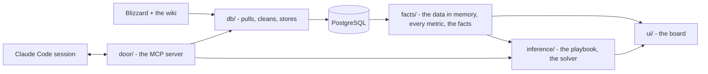

# Countrix

[](https://github.com/mmikol/countrix/actions/workflows/ci.yml)


Countrix picks Overwatch 2 team compositions. It keeps hero kits, maps,
counters and per-map win rates in PostgreSQL, turns a draft into numbered
facts, and finds the highest-scoring six (a team of six heroes) under a
playbook of markdown strategy files a person can read and tune. Every
reason it gives cites a fact.


*King's Row, blue on attack, two picks a side, Widowmaker banned, on the
shipped playbook. The solver fills blue's six around Ana and Reinhardt (the
dashed tiles); red's dashed tiles are its likely six. Blue's badge is its
six as a share of the best six it could field here; red's is how often a six
fields its heroes. The fight odds split 100 between the two sixes by the gap
between their scores on the default engine alone, and are not a chance of
winning. The pictures show the numbers the board computes from Blizzard's
rates, by the owner's decision ([the licence](#the-licence)).*

## The method

Countrix pulls Blizzard's hero pages and win rates and the Overwatch wiki's
kits, maps, counters and synergies, cached and rate-limited, with no API
keys.

The map, the side, the bans and both teams' picks become numbered facts
(F1, F2, ...): a hero on this map, against each enemy, beside each ally,
and the six against the six.

The playbook and the facts make one weighted, constrained objective, solved
exactly ([how a six is chosen](docs/inference.md#how-a-six-is-chosen)). The
space is every six of the released roster, each set of heroes once, at most
two tanks. The playbook's constraints prune it and weigh nothing: 13,030,920
legal sixes remain on an open board on the roster of 2026-10-05, fewer with
bans or locks.

The default engine, the meta, scores every six left on its win rates on the
map trusted by pick rate, on the wiki's synergies and on its counters to the
other side: the wiki's, and answers derived from the kits where the wiki says
nothing. One meta weight scales it. The heuristics add or subtract from the
same facts, each times its weight. A branch-and-bound search proves the best
six, scoring a few dozen in full, and returns the next best in order. No
weight is learned: a rule's starts from its prose and the engine's from a
calibration, and a person can tune each one.

A six can change during a map. Above blue's picks, the board suggests the
swaps that pay for their cost, as one joint answer: the incoming hero's
portrait over the pick it replaces, taken with a click. On a map with stages
it lays the map out a stage at a time; each phase keeps its heroes unless a
swap there beats the cost, and each stage has a plan worded from the facts.

Countrix serves a web board and an MCP (Model Context Protocol) server, the
tool interface a Claude Code session uses to draft comps and tune the
playbook. The board solves by arithmetic and calls no model.


*Ana and Reinhardt, locked, and the four the solver filled in, each with its
reasons - who it answers and pairs with, its win rate on the map, the style
it fits, who answers it - and the numbered facts they cite.*


*The default engine's three bars - the six's win rates on the map, its
synergy and its counters - then a bar per rule of the playbook under three
tabs (satisfied, costing and did not read), all on one scale, each with the
fact it read. A limit that holds adds nothing; what a six gives up shows
under costing. The count over the bars is the space the exact search
covered.*

## The architecture



Three layers sit over one database, each a package, and a test fails any
import that reaches up a layer. Every write goes through one door, the MCP
server: 27 MCP tools over stdio, HTTP or in-process, each schema-checked,
and the query tool runs as a read-only database login. Every metric is
defined once, so the number on the board and the number the solver
maximises come from the same function. The playbook is markdown: each
strategy is a file with a few lines of frontmatter, `meta.md` beside them
holds the default engine's weights, and the solver reads nothing else. The
solver is deterministic: a board is the same payload under any hash seed,
with one total order and each six scored in one seat order.

The stack runs five containers. Three services share one image; they and
the nightly `pg_dump` run unprivileged on a read-only root with every
capability dropped, and PostgreSQL keeps the five capabilities it needs to
start. Every port binds to loopback, and every HTTP server refuses a foreign
Host or Origin.

Countrix is built on Python 3.12, PostgreSQL 16 and psycopg, with requests
and beautifulsoup4 for the scrapers, the standard library's HTTP server and
no web framework, plain JavaScript with no build step, and Docker Compose.

## The checks

CI runs ruff, mypy and every test that needs no database on every push to
main and every pull request, held to 78% line coverage. With the database
built, all the tests run against a 75% floor. They sit in three folders: QA
(the house rules), verification (the code against its spec) and validation
(against recorded games, empty for now). mypy checks every source module in
CI, and records that cross a module boundary are dataclasses, NamedTuples or
TypedDicts.

A CI gate enumerates every legal six on small synthetic boards and fails
unless the search returns the true best sixes in order, and a fuzz holds
every bound to the sixes it covers. On the built database, a brute force of
every legal six on real boards agrees with the search bit for bit. The
board's study page writes out the proof, lemma by lemma, beside the study's
results.

The documentation is tested: relative links resolve, every setting is
documented, the generated schema, tool and catalog references match a fresh
render, and the user guide builds with no warning.

## The quick start

You need [Docker](https://www.docker.com/products/docker-desktop/) with
Compose v2 and Python 3.12.

```bash
git clone https://github.com/mmikol/countrix.git && cd countrix
python3.12 -m venv .venv && .venv/bin/pip install -r requirements.txt
.venv/bin/python orchestrator.py up
```

Then open http://localhost:8017. The first start builds the image, then the
database from the sources, about ten minutes at a polite pace; later starts
reuse the database. The board runs the shipped playbook, its rules listed in
[the catalog](docs/inference.md#the-catalog), on top of the default engine.
[The user guide](user-guide/README.md) takes a player or a team through the
board from there, task by task.

The tests prove the solver against a reference playbook,
`tests/fixtures/playbook`. `echo COUNTRIX_STRATEGIES=tests/fixtures/playbook >> .env`
before `up` puts the stack on it instead. The stack reads that folder from
its image, so `/tune` and `/strategy` cannot change it there.

| | |
| --- | --- |
| the board | http://localhost:8017 |
| the MCP server | http://localhost:8020/mcp |
| PostgreSQL | localhost:5433 (`./docker-db <command>` points a host command at it) |

```bash
.venv/bin/python orchestrator.py status    # what is running, how fresh the data is
.venv/bin/python orchestrator.py down      # stop everything; the database volume stays
```

The stack dumps its database into `backups/` every night and keeps the
newest 14; the dumps hold the dated rates history, which a rebuild drops and
no source gives back. The data container migrates a stale schema in place;
before it rebuilds a database whose migration failed, it takes one more
dump, which the rotation keeps. [docs/db.md](docs/db.md#the-nightly-dump)
has the restore.

Without Docker, an embedded PostgreSQL (`pgserver`, macOS and Linux x86_64)
holds the database:

```bash
.venv/bin/python -m door.mcp call db_rebuild   # build the database
.venv/bin/python -m ui.board                   # the board, http://localhost:8017
```

## The commands and the skills

```bash
.venv/bin/ruff check db facts inference door ui tests orchestrator.py
.venv/bin/python -m mypy db facts inference door ui orchestrator.py
.venv/bin/python -m pytest -q --cov                                     # the full suite, 75% floor
COUNTRIX_NO_DATABASE=1 .venv/bin/python -m pytest -q --cov --cov-fail-under=78   # what CI sees: no database
./docker-db .venv/bin/python -m pytest -q                               # against the stack's database
```

The repo holds skills for [Claude Code](https://claude.com/claude-code):
`/comp` drafts a comp with cited reasons, `/tune` and `/strategy` edit the
playbook through the door, `/heroes`, `/maps` and `/patches` keep the data
current, and `/maintain` runs the checks and keeps the docs current.
[CLAUDE.md](CLAUDE.md) is the guide a session reads first.

## The documentation

- [user-guide/](user-guide/README.md) - the user guide, for a player or a team: installing and starting, the board step by step, its tabs, the registry, the math page and the study, tuning the playbook, the data, troubleshooting; a MkDocs site, built strict in CI
- [docs/architecture.md](docs/architecture.md) - the layers, the folders, the settings, the skills, the scope
- [docs/db.md](docs/db.md) - the data layer: the sources, the schema, the refresh
- [docs/inference.md](docs/inference.md) - the playbook format, the solver, the tuning loop
- [docs/ui.md](docs/ui.md) - the board: its pages and endpoints, the math page (the objective, with the code's constants), the strategy registry (each rule's math, with its own numbers) and the study (the proof that the search is exact, and the study's results against the tools people use)
- [docs/mcp.md](docs/mcp.md) - the two MCP servers and every tool
- [docs/security.md](docs/security.md) - the threat model and what stands in the way

## The licence

Copyright © 2026 Miliano Mikol. The [PolyForm Strict License 1.0.0](LICENSE)
covers Countrix's own code and text: noncommercial use only, no
redistribution, no changes or new works; anything else needs a separate
written licence.

Beyond PolyForm Strict, anyone may change the files of the playbook -
`inference/strategies/`, its rules and the weights in `meta.md` - for their
own noncommercial use, as [NOTICE](NOTICE) grants. The rest of Countrix
stays under PolyForm Strict.

PolyForm Strict covers none of the third-party material NOTICE lists; each
is under its own terms.

Hero kits, maps, terrain, playstyles, synergies and counters come from the
[Overwatch Wiki](https://overwatch.fandom.com) at Fandom, written by its
contributors and licensed under
[CC BY-NC-SA 3.0](https://creativecommons.org/licenses/by-nc-sa/3.0/).
Quoted wiki text - in the tests, the docs and the board's facts - keeps that
licence; NOTICE names each file that quotes it and the articles.

The display face, Bebas Neue, is by Dharma Type under the
[SIL Open Font License 1.1](ui/static/OFL.txt).

Hero and map names, portraits, role icons, Blizzard's hero text and its win,
pick and ban rates are Blizzard's, used under
[Blizzard's fan-site permission](https://www.blizzard.com/en-us/legal/c1ae32ac-7ff9-4ac3-a03b-fc04b8697010/blizzard-legal-faq)
for home, noncommercial and personal use. The rates are licensed for
personal use only: they are pulled into a local database and never
committed. By the owner's decision of 2026-10-05, the study's results and
the screenshots of the board show numbers computed from them, and
CounterWatch's 6v6 data, which the study measures against, stays in a
private benchmark repository.

Overwatch™ © 2016 Blizzard Entertainment, Inc. All rights reserved.
Overwatch is a trademark or registered trademark of Blizzard Entertainment,
Inc. in the U.S. and/or other countries. Countrix is a fan project, not
affiliated with or endorsed by Blizzard Entertainment.
