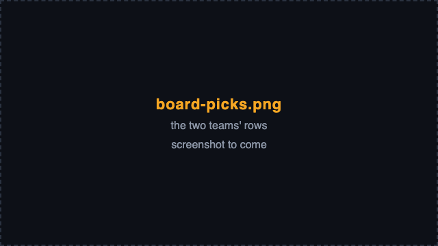
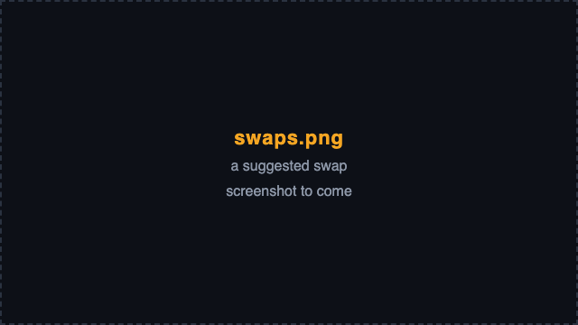
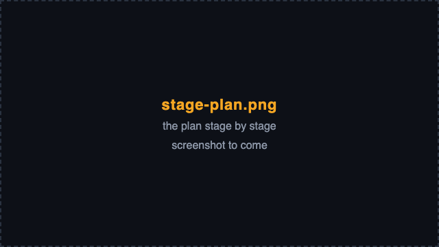

# The board, step by step

The board is one page: the header with the map, the bans bar, the fight
odds, the two teams, and three tabs under them - comps, facts and
playbook. Every click asks the board again; on a recent machine a board
solves in about half a second. Fill in what you know: the board answers
at every step, from an empty draft to two full sixes.

## 1. Choose the map

Pick the map from the list at the top left. Its first entry, MAP
UNKNOWN / ANY, leaves the map open, and the board still answers.

Beside the list a chip names the map's mode and the style the map
rewards - dive, brawl or poke - read from its rates and from the ground
the wiki's article describes: *Hybrid · rewards brawl*.

## 2. Choose the stage

A map with stages shows a second list beside the map: a Control map's
rounds, a Flashpoint map's points, a Hybrid map's two phases, an Escort
map's named stretches. WHOLE MAP, the default, plans for the map as a
whole; a stage plans for that stage's ground. The list hides on a map
without stages, and changing the map clears it.

## 3. Choose your side

Escort and Hybrid maps have an attacking and a defending side. The
*attack* / *defense* switch sets blue's, red gets the other, and the
chip adds *blue attacks* or *blue defends*. A second click on the chosen
side clears it. On Control, Push and Flashpoint maps the switch hides
and the chip says *no sides*.

## 4. Set the bans

The bans bar sits under the header, closed: *bans*, the count (*1/5*),
and each ban as a small portrait. Click the bar to open it: five slots -
red's two, blue's two and the lobby's - over every hero's portrait.

- Click a portrait to ban that hero. A banned hero leaves both teams
  and the search.
- Click a banned portrait, its slot or its small portrait in the closed
  bar to lift the ban.
- At five bans the other portraits dim, and a sixth is refused with
  *5 bans already*.

## 5. Enter the picks

Each team has its box, blue on the left and red on the right, with its
roster in three columns: tank, damage, support. Click a portrait to pick
that hero for that team, and click it again to take the pick back.

- A picked portrait is lit on its own team and dotted on the other. A
  hero may play for both teams, never twice on one.
- A banned hero is crossed out, and a click on it says it is banned
  this match.
- A team holds six; a seventh pick is refused.
- A portrait dims when its team has no room for one more of its role:
  two tanks at most for either team, and for blue whatever the
  playbook's limits allow. A click on it is refused with a note in the
  header.
- A hero the wiki knows ahead of release sits dimmed in its role with
  *coming soon*, its release day in its tooltip. It cannot be picked
  until Blizzard lists it and the data refreshes.

Enter red's picks as they reveal and blue's as your team locks them in.

## 6. Read the rows

Over each roster sits the team's row of six slots. The row reads tank,
then damage, then support, so a glance tells what each team fields.
Within a role the team's picks come first, solid, in the order picked;
then the board's suggestions for the open slots, dashed. Once the board
answers, every slot holds a hero.

Only the drawing follows the roles. The picks stay stored, and are
sent to the board, in the order you made them.

An open slot stands empty, numbered from 1, only while the board has no
answer for it: before its first answer, after a request fails, and on
red's row for the moment a board solves a new red pick. The last number
says how many stand empty.

## 7. Use the suggestions

The dashed portraits are the board's answer for the open slots.

- Blue's are the fill: the best six that keeps your picks. Before any
  blue pick they are blue's optimal six.
- Red's are their likely six: red's picks, then for each open slot the
  hero with the highest pick score - how often a six fields it, plus a
  bonus for each synergy partner already on the six.

Hover a slot for its reason. Click a dashed portrait to lock it in as a
pick; click a solid one to take the pick back. While the board thinks,
blue's open slots keep the last answer's suggestions in place.

## 8. Take a swap

Once blue has picks, the board asks whether trading any of them pays. A
swap costs something - the walk back, the ultimate charge lost - so the
board suggests one only when its gain beats the swap cost. Where a swap
pays, the incoming hero's portrait sits above the pick it would replace,
under a caption that names the swaps and blue's share before and after:
*swap Zarya for Doomfist: N -> M / 100 of the optimal, at a cost of
10 / 100 a swap*, where N is your six's share now - your picks filled,
while you still draft - and M its share after the swap. Click the
portrait to take that swap, and the board solves again.

The swaps are one joint answer: after you take one, the rest are the
board's answer from your new picks. Where no swap pays, nothing shows
above blue's picks. Red gets no swaps. The swap cost slider on the
[playbook tab](playbook.md#the-meta-and-its-sliders) sets how much a
swap must gain.

## 9. Follow the stage plan

On a map with stages, the comps tab sets out the plan *stage by stage*
under the game plan: a row a stage in play order, with its name and
kind - a phase of a Hybrid or Escort route, or an arena of a Control or
Flashpoint map - its six with the heroes swapped in outlined, and a line
on what the stage's own ground asks for and whether to swap there.

- Along a route, each phase starts from the six of the phase before and
  changes a hero only where the swap pays for its cost there.
- On a Control or Flashpoint map, each arena starts from the six the
  tab shows.
- Choose a stage in the stage list and its row reads *here*, with the
  board's swap answer for it; the phases before it read *played* and
  show no six.

## 10. Read the fight odds

The strip over the teams splits 100 between blue's six and red's likely
six: *blue 60, red 40*, say. Both sixes are scored on the default
engine alone - win rates, synergies and counters - and the gap between
the two scores sets the split along a smooth curve: equal scores split
50 / 50, and a wider gap leans further. There is no percent sign. The
split is the model's reading of the gap, not a chance of winning
measured from matches. Hover the strip for the engine's own words.

The strip reads *solving…* while a board is searched. Where there are
no odds - with the Meta slider at 0, for one - it shows the engine's
verdict instead.

## 11. Read the badges

Each team's title carries a badge.

- **Blue's** is its share: your six on a scale where 100 is the best six
  for this draft and 0 the weakest of a sample of sixes. While blue
  still drafts, it reads the share the best six from your picks
  reaches; before any pick, the suggested six's 100.
- ***not allowed*** means blue's picks break one of the playbook's
  limits - four supports, say. The tooltip names the limit, the comp has
  no score or share, and the swaps show the way back to an allowed six.
- ***unscored*** means nothing on the board scores - the Meta slider and
  every rule's weight at 0 - so every six ties, and no share would mean
  anything.
- **Red's** is how often a six fields the heroes of red's likely six, on
  average (*N% avg pick*). Red has no share, since it is never
  optimized.

Hover a badge for what its figure means. A share is a place between two
sixes on the model's own scale, never a probability.

## 12. Clear, and come back

*clear all* in the header empties the map, the side, the bans and both
teams, and keeps your slider weights. Each team's *clear* empties that
team alone. The board keeps the map, the stage, the side, the bans, the
picks, the weights and the open tab in your browser, so a reload
mid-game loses nothing.

The pills at the top right link the pages behind the board, such as
[the math page](math.md) and [the registry](registry.md), and the
repository on GitHub.
