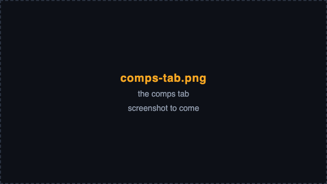

# The comps tab

The comps tab is the board's answer in full: the game plan, the plan
stage by stage, and each team's six with every reason and every score
behind it.

## The game plan

On top, the plan in a few lines of prose: what the map asks for, what
your side has to do, how the six plays, what red's picks so far lean
towards and who answers them, the heroes in the six's family if you
stray from it, and what weighs most in its score. Its last line, *Based
on:*, says what the board knew: the rates and counters, the map, the
side, the bans, the picks.

On a map with stages, the plan stage by stage follows it; [step 9 of
the board](board.md#9-follow-the-stage-plan) reads it.

## Blue's seat

Blue's seat is on the left. Its title says which six it shows:

| title | when | shows |
| --- | --- | --- |
| *blue - your picks, the rest filled* | one to five blue picks | your picks and the fill |
| *blue - your six* | six blue picks | your six as it stands |
| *blue - optimal vs red's likely six* | always, last | the best six from scratch, before red reveals a pick |
| *blue - optimal vs red's picks* | always, last | the same, once red has revealed one |

The optimal holds none of your picks: it is what blue would field from
scratch against red. Before any blue pick it is the only six in the
seat. With a side chosen, its title ends with it: *blue - optimal vs
red's picks, on attack*.

## Red's seat

Red's seat is on the right: *red - likely starting comp* before red
reveals a pick, *red - their picks, the rest likely* after, with the map
and red's badge in the title. Each card's reason gives the hero's pick
score: how often a six fields it on this map, and the partners it
pairs with. Red is never optimized and reads no rule of the playbook,
so only a new map, a ban or a red pick changes it.

## Under each of blue's sixes

- **The cards.** One per hero, tanks first, then damage, then supports:
  the portrait, the role, the reason, and a chip for each fact the
  reason cites. Hover a chip to read the fact.
- **The search's numbers.** *147,568 candidates · 0.03s · leans brawl*,
  for example: how many sixes the search covered, how long it took,
  and the style the six leans to. Where other sixes tie with this one,
  a line says the tie-break chose it.
- **The default engine.** Three bars, always shown: `base.rates`,
  `base.synergy` and `base.counters` - what the six's win rates, its
  synergy pairs and its counters are worth, each with the fact it read.
- **The playbook's rules.** One bar a rule, in three tabs:
    - *satisfied* - the rules the six meets;
    - *costing* - the rules that charge it, with their summed cost;
    - *did not read* - the rules that never counted here, because their
      condition does not hold or nothing on the board gives them a
      number.

    The filter box narrows the bars by name or reason. Hover a bar for
    one sentence on why it paid, charged or did not count.

- **The alternatives.** The next best sixes of the whole legal space, in
  order.

Every bar shares one scale, so a long bar outweighs a short one wherever
it sits. A limit the six keeps adds nothing; what a six gives up shows
under *costing*.
