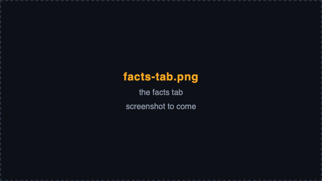

# The facts tab

The facts tab lists every fact the database holds about the draft,
numbered F1, F2, ... in the order the board writes them. Every reason on
the board cites one of them.

## A fact

Each row is one fact: its number, its text, and where it came from - a
table such as `hero_meta` (Blizzard's rates), `counters` (the wiki's
match-ups) or `synergies` (the wiki's team synergy), or `derived:` for a
fact worked out from others. A fact that warns of a danger opens with
WARNING: *WARNING: blue Reinhardt is answered by red Pharah*.

The first fact, F1, is the rates' capture: when Blizzard's rates were
taken, under which patch, and for which queue, platform and region.

A line under the list credits the Overwatch Wiki, whose kits, maps,
terrain, playstyles, synergies and counters the facts quote, and its
licence, CC BY-NC-SA 3.0; the rates are Blizzard's
([credits and licences](credits.md)).

The facts come in groups, each under a heading: *meta* (the rates'
capture), *bans*, *map*, each hero of each team (*blue · Ana*), each
team (*blue team*), and *matchup*, the two teams set against each
other. Each side's heroes come tank, damage, support, each role in the
order picked.

## Find a fact

- Type in the filter box to keep the facts whose number, key, subject
  or text contains what you typed.
- The six chips - *meta*, *bans*, *map*, *hero*, *team*, *matchup* -
  switch a group on and off.
- The count beside the filter says how many show: *820 facts*, or
  *12 of 820 facts* under a filter.

A fact's number belongs to this draft: a new pick, ban or map numbers
the facts again.
