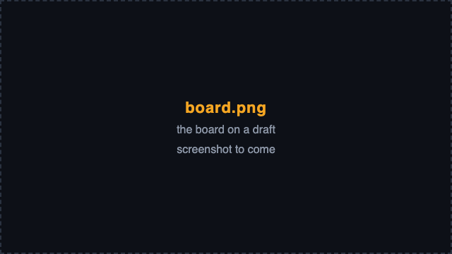

# Countrix

Countrix picks a team for a game of Overwatch 2. You tell it the map,
your side, the bans and the heroes each team has picked so far. It
answers with the six heroes that score highest for your team, a reason
for each pick, and the numbered facts behind every reason.

It runs on your own machine: a database of Blizzard's and the Overwatch
Wiki's data, and a web page over it, the board. There is no account, no
key and no fee.

*The board on King's Row, blue on attack, two picks a side, one ban.*

## What it is

- **A model.** It gives a team of six heroes - a *six* - one score. The
  base of every score, the *default engine*, reads three things: how
  often each hero wins on this map by Blizzard's rates, the wiki's
  synergy pairs inside the six, and the wiki's counters against the
  other team. The *playbook*, a folder of short rule files, adds its
  rules on top: "every six carries a save", "heal at the other side's
  rate".
- **An exact search.** Of the millions of legal sixes it proves which
  one scores highest, then lists the next best in order. A search it
  cannot finish within its budget refuses; it never guesses.
- **Deterministic.** The same draft gives the same answer every time.
- **Open about its reasons.** Every reason cites a fact (F1, F2, ...),
  and the facts tab lists them all.

## What it is not

!!! warning "A model's optimum, not a win promise"
    The best six is the best for the model: its data, its weights and
    its assumptions. Countrix does not promise that it wins.

- The badge over your team (*80 / 100*, say) places your six between
  the weakest of a sample of sixes, 0, and the best six for this
  draft, 100. It is not a chance of winning.
- The fight odds split 100 between the two sixes as the model reads the
  gap between their scores. No match results stand behind the split.
- The rates are Blizzard's Competitive Role Queue, five a side, on
  console in the Americas. Countrix plays 6v6 Open Queue, six a side,
  and reads them as the nearest numbers Blizzard publishes; Countrix
  reads only Blizzard and the wiki.
- Every player is assumed to play optimally. Countrix knows nothing of
  your hero pools, your comfort picks or your comms.
- The other team is never optimized. Countrix reads their likely six
  from how often heroes are picked, then their real picks as they show.
- The board calls no AI model: it is arithmetic on your machine. Claude
  Code is optional, to ask for a comp in chat and to change the
  playbook.

## The words this guide uses

| word | means |
| --- | --- |
| blue | your team, the one Countrix picks for |
| red | the other team |
| a six | one team of six heroes |
| a pick | a hero a team has locked in |
| the fill | the best six that keeps blue's picks |
| the optimal | blue's best six for the draft, holding none of blue's picks |
| a fact | a numbered line about the draft, F1, F2, ...; every reason cites one |
| the default engine | the base of every score: win rates, synergies, counters |
| the playbook | the rules on top of it: limits, heuristics and assumptions |
| the share | blue's six on a scale where the optimal is 100 |

## The guide, task by task

1. [Install and start](install.md) Countrix, with Docker or without.
2. [Read the board](board.md): the map, the stage, the side, the bans,
   the picks, the suggestions, the swaps, the stage plan, the fight
   odds and the badges.
3. Read its three tabs: [comps](comps.md), [facts](facts.md) and
   [playbook](playbook.md).
4. Look behind the answer: [the registry](registry.md) of rules,
   [the math page](math.md) and [the study](study.md).
5. [Tune the playbook](tuning.md) to your team, and keep
   [the data](data.md) fresh.
6. When something goes wrong: [troubleshooting](troubleshooting.md) and
   [questions](faq.md).

[Credits and licences](credits.md) name the work Countrix stands on.
