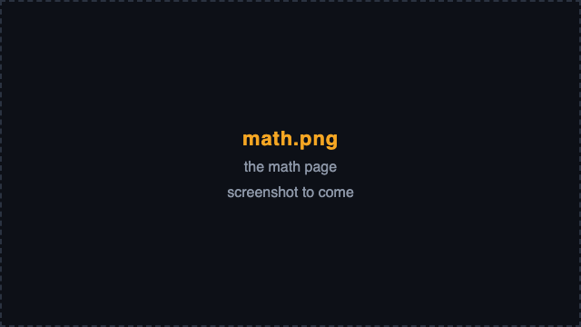

# The math page

The math page is the whole model in one place: the equation Countrix is
named after, how a six is chosen, and every term of the score. Open it
from the board's header, *the math*, or at http://localhost:8017/math.
The numbers it quotes - the default engine's weights, the swap cost, the
search's constants - are filled in from the code and the playbook's
`meta.md` each time it loads, so the page says what the solver runs.

The pills at the top jump to each part:

| part | what it holds |
| --- | --- |
| the counter utility matrix | the equation: the data, the facts, the playbook, and the comp as the best legal six; Countrix is short for Counter Utility Matrix |
| how a six is chosen | the five steps: every legal six, the limits, the default engine, the heuristics, and the best six, proved |
| the function | the score of one six, term by term: the default engine, sustained healing, the healing bar |
| what 100 means | the share, its floor and its 100 |
| fight odds | how the split of 100 between the two sixes is worked out |
| the problem's class, the argmax, what is searched | why the search is exact, and how many sixes it covers |
| what it is optimal against | red's six as the board reads it |
| swaps and stages | the swap cost and the plan stage by stage |
| deterministic, not probabilistic | why the same draft gives the same six |
| the board page | red's likely comp, blue's optimal counter, the weights |
| how the pieces fit | the layers under the board |

The page is for a reader who wants the formulas; the rest of this guide
needs none of them. [The registry](registry.md) writes each rule of the
playbook out in the page's notation, with its own numbers, and links its
form back here.
