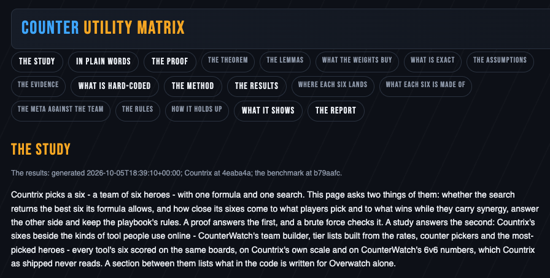

# The study

The study asks whether the engine does what it claims: that it truly
optimizes a team, given its assumptions, and how its sixes compare with
the tools players use online. Its results are a page on the board -
open it from the board's header, *the study*, or at
http://localhost:8017/study. A report, *The Study/Proof*, sets the same
results out with every figure, links the math page and the registry,
and says how to run the proof and the study again; the page's last
section, *the report*, links it.

What the study shows:

- **The proof.** That the search returns the best legal six for its own
  score, given the assumptions, and the checks that hold it to that: a
  brute force of every legal six on real boards, and each claim counted
  on every board of the study.
- **Nothing hard-coded?** Which parts of the code name a hero, a map or
  an ability, and what is fixed for Overwatch: the three roles, and the
  facts that read the wiki's kits.
- **The meta.** How close its sixes come to what players pick and to
  what wins, by Blizzard's numbers and by CounterWatch's 6v6 numbers,
  and how many heroes they share with the most-picked sixes and the
  tier lists.
- **Synergy and counters.** How much of each its sixes carry, by the
  wiki and by CounterWatch.
- **The rules.** What the playbook's heuristics add to a six, and what
  they cost it.
- **The benchmark.** Where Countrix's six lands beside CounterWatch's
  team builder and the kinds of tool players use online: the most-picked
  heroes, win-rate tier lists, two meta trackers' tier formulas and
  counter pickers.
- **Whether it holds.** On the other half of the maps, on an earlier
  benchmark's boards, with the three heroes Countrix fields most banned,
  on an older capture of the rates, and with the engine run in memory on
  CounterWatch's 6v6 rates, which are never stored.

## How to read it

- **Each tool leads on its own numbers.** Every six is scored on two
  yardsticks: Countrix's own scale and CounterWatch's 6v6 numbers. Each
  is 0 at the average random six and 100 at the best six its own model
  knows, so CounterWatch's builder leads on CounterWatch's yardstick by
  construction, and Countrix on its own. Read a tool's lead at home as
  the yardstick's, not the tool's. Countrix's scale is not the board's
  badge: the badge puts 0 at the weakest of a sample of sixes, the
  study at the average random six.
- **The maps are no clean hold-out.** The results are read on the test
  half of the maps, split before any result was seen, but the synergy
  and counter weights were halved on 2026-10-04 with both halves'
  results in view: no map is untouched by tuning. The other team's
  sixes are drawn afresh for the study, and no tuning saw them.
- **No match results stand behind it.** No source publishes 6v6 match
  results, so every yardstick is a model's reading of the numbers it
  holds, not a count of games won.

CounterWatch's raw data stays in a private benchmark repository; only
the study's results are published. Countrix itself still reads Blizzard
and the wiki alone.
